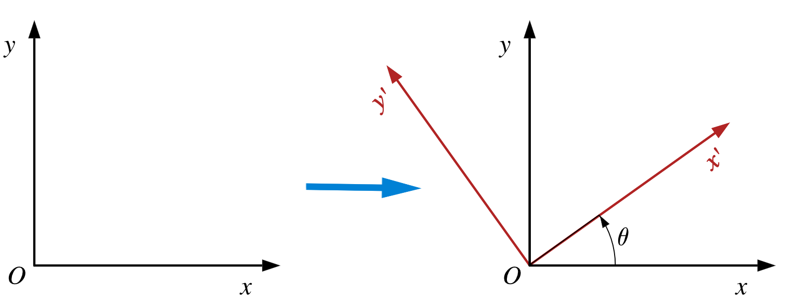

# Systèmes de coordonnées homogènes - Vision 3D

## Sommaire

[TOC]

## Introduction

Tiré de http://www.isir.upmc.fr/UserFiles/File/clady_homepage/EPU/5-3Dcomputervision.pdf

Les systèmes de coordonnées homogènes sont très utilisés dans les domaines suivants:

- vision par ordinateur 3D
- synthèse d'images 3D
- modélidation des robots
- modélisation de processus dynamiques 3D.

Nous verrons les points suivants

- Coordonnées homogènes
- Modélisation de caméra: modèles pinhole
- calibrage d'une caméra

## Systèmes de coordonnées homogènes

Les systèmes de coordonnées homogènes permettent de définir une transformation entre 2 référentiels avec une simple multiplication matricielle:
$$
\mathbf{\tilde{p}} =\mathbf{T\tilde{p}'}
$$
où $\mathbf{\tilde{p}}$ représente les coordonnées d'un point P dans un référentiel donné, et $\mathbf{\tilde{p}'}$ les coordonnées de ce même point dans un autre référentiel.

### Représentation de la position d'un objet 3D dans l'espace

On doit être capable de représenter les objets en 3D dans leur structure interne; nous devons aussi pouvoir décrire la **pose** de l'objet 3D:

- sa *position*
- ainsi que son *orientation*

Si on se restreint aux objets rigides, non déformables, un objet sera complètement décrit par sa position et son orientation dans un référentiel donné.

Pour expliciter la position et l'orientation de l'objet affiché ci-dessus, considérons le référentiel $O'_{x'y'z'}$ attaché à l'objet. La pose de l'objet sera décrit par la pose du référentiel objet.

La position de $O'$ dans $(O_{xyz})$ est donné par $\boldsymbol{O'} = O'_x\boldsymbol{X} + O'_y\boldsymbol{Y} + O'_z\boldsymbol{Z}$.

Nous devons donc déterminer la pose de $(O'x'y'z')$ dans $(Oxyz)$, c'est à dire comment $(O'x'y'z')$ est orienté (rotatop,) et translaté dans $(Oxyz)$.

#### Translation

La **translation** correspond simplement au vecteur $\boldsymbol{o'} = O' - O$.

#### Rotation

Pour expliciter la représentation d'une rotation au moyen d'une opération matricielle, nous étudions d'abord le cas 2D.

##### Rotation 2D

Etant donné une paire d'axe $(x,y)$ leur rotation par un angle $\theta$ centré à l'origine peut être données par la relation:
$$
\begin{bmatrix}
x'\\y'
\end{bmatrix}
= 
\begin{bmatrix}
\cos{\theta} & -\sin{\theta} \\
\sin{\theta} & \cos{\theta}
\end{bmatrix}
\begin{bmatrix}
x\\y
\end{bmatrix}
$$

##### Rotation 3D

En 3D, une relation pour une rotation autour de l'axe $\boldsymbol{Z}$ est obtenue de manière similaire:
$$
\begin{bmatrix}
X'\\Y'\\Z'
\end{bmatrix}
= 
\begin{bmatrix}
\cos{\theta_z} & -\sin{\theta_z}& 0 \\
\sin{\theta_z} & \cos{\theta_z} & 0 \\
0 & 0 & 1
\end{bmatrix}
\begin{bmatrix}
X\\Y \\ Z
\end{bmatrix}
$$

Cette équation peut s'écrire:
$$
\boldsymbol{X'} = \boldsymbol{R_z}(\theta_z)\boldsymbol{X}
$$
Pareillement pour l'axe $Y$:
$$
\begin{bmatrix}
X'\\Y'\\Z'
\end{bmatrix}
= 
\begin{bmatrix}
\cos{\theta_y} & 0 & \sin{\theta_y}\\
0 & 1 & 0 \\
-\sin{\theta_y} &  0 & \cos{\theta_y}

\end{bmatrix}
\begin{bmatrix}
X\\Y \\ Z
\end{bmatrix}
$$

$$
\boldsymbol{X'} = \boldsymbol{R_y}(\theta_y)\boldsymbol{X}
$$

et pour l'axe $X$:
$$
\begin{bmatrix}
X'\\Y'\\Z'
\end{bmatrix}
= 
\begin{bmatrix}
1 & 0 & 0 \\
0 & \cos{\theta_x} & -\sin{\theta_x}\\
0 & \sin{\theta_x} & \cos{\theta_x}

\end{bmatrix}
\begin{bmatrix}
X\\Y \\ Z
\end{bmatrix}
$$

$$
\boldsymbol{X'} = \boldsymbol{R_x}(\theta_x)\boldsymbol{X}
$$

### Systèmes de coordonnées homogènes

#### Rotations élémentaires

- Les rotations élémentaires sont les rotations autour des axes du référentiel "courant".
- En 3D il y a 3 rotations élémentaires:
  - $\boldsymbol{R_x}(\theta_x)$ la rotation autour de l'axe X,
  - $\boldsymbol{R_y}(\theta_y)$ la rotation autour de l'axe Y,
  - $\boldsymbol{R_z}(\theta_z)$ la rotation autour de l'axe Z.

Que se passe-t-il si nous faisons pour l'une de ces matrices une opération sur $-\theta$ ? Nous constatons que cela revient à obtenir la rotation associée à la matrice transposée:
$$
\begin{align}
& \boldsymbol{R_k}(-\theta) = \boldsymbol{R_k}(\theta)^T \\
\longrightarrow & \boldsymbol{R_k}(\theta)^T \boldsymbol{R_k}(\theta) = \boldsymbol{I_3}
\end{align}
$$
Ce qui implique que: $\boldsymbol{R_k}(\theta)^{-1} = \boldsymbol{R_k}(\theta)^T$ donc que la matrice inverse de ces rotations est la matrice transposée.

#### Point $\boldsymbol{p}$ dans $\boldsymbol{O_{xyz}}$

Si l'on considère un point $\boldsymbol{p}$ dans $\boldsymbol{O_{xyz}}$, on peut écrire $\boldsymbol{p}= p_x\boldsymbol{X} + p_y\boldsymbol{Y} + p_z\boldsymbol{Z}$.

En autres termes, il peut s'écrire comme un vecteur borné:

$$
\boldsymbol{p} = \begin{bmatrix}
p_x \\ p_y \\ p_z
\end{bmatrix}
$$
Le vecteur est dit *borné* parce que sa norme est fixe.

#### Point $\boldsymbol{p}$ dans $\boldsymbol{O_{x'y'z'}}$

Si nous introduisons un second référentiel $\boldsymbol{O_{x'y'z'}}$ dont l'origine coïncide avec $O$, le point $p$ est représenté dans ce nouveau référentiel par
$$
\begin{align}
\boldsymbol{p} &= p'_x \boldsymbol{X'} + p'_y \boldsymbol{Y'} + p'_z \boldsymbol{Z'} \\
& = \begin{bmatrix} \boldsymbol{X'} &  \boldsymbol{Y'} & \boldsymbol{Z'} \end{bmatrix}
\begin{bmatrix} p'_x \\ p'_y \\ p'_z \end{bmatrix} \\
& = \boldsymbol{Rp'}
\end{align}
$$
où $\boldsymbol{R}$ est la matrice de rotation décrivant l'orientatino de $\boldsymbol{O_{x'y'z'}}$ par rapport à  $\boldsymbol{O_{xyz}}$.

Nous avons donc:
$$
\boldsymbol{p} = \boldsymbol{Rp'}
$$
soit
$$
\boldsymbol{p'} = \boldsymbol{R}^T\boldsymbol{p}
$$

#### Angles RTL / RPY

Le Roulis (roll), le tangage (pitch) et le Lacet (yaw) sont des angles décrivant la rotation de l'objet selon le *référentiel lié à l'objet*.

Tous cela de tel sorte que, si nous avons $\boldsymbol{R}(\theta_x, \theta_y,\theta_z) = \boldsymbol{R_z}(\theta_z)\;\boldsymbol{R_y}(\theta_y) \; \boldsymbol{R_x}(\theta_x)$:

- $\boldsymbol{R_x}(\theta_x)$ est la rotation autour de l'axe $\boldsymbol{X}$ représentant le **roulis** (roll),
- $\boldsymbol{R_y}(\theta_y)$ est la rotation autour de l'axe $\boldsymbol{Y}$ représentant le **tangage** (pitch),
- $\boldsymbol{R_z}(\theta_z)$ est la rotation autour de l'axe $\boldsymbol{Z}$ représentation le **lacet** (yaw).

**Attention: l'ordre d'application des matrices de rotation est très important**, d'abord le roulis, puis le tangage, puis le lacet.

#### Rotation autour d'un axe quelconque

Ces rotations permettent de définir des rotations autour d'un axe quelconque, par exemple un axe défini par un vecteur $\boldsymbol{r}:$